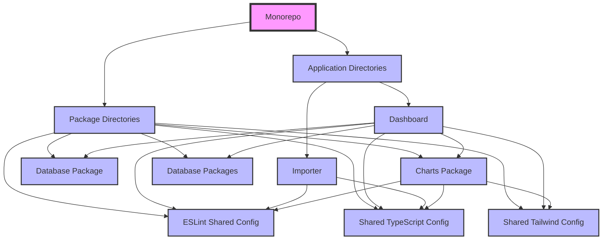
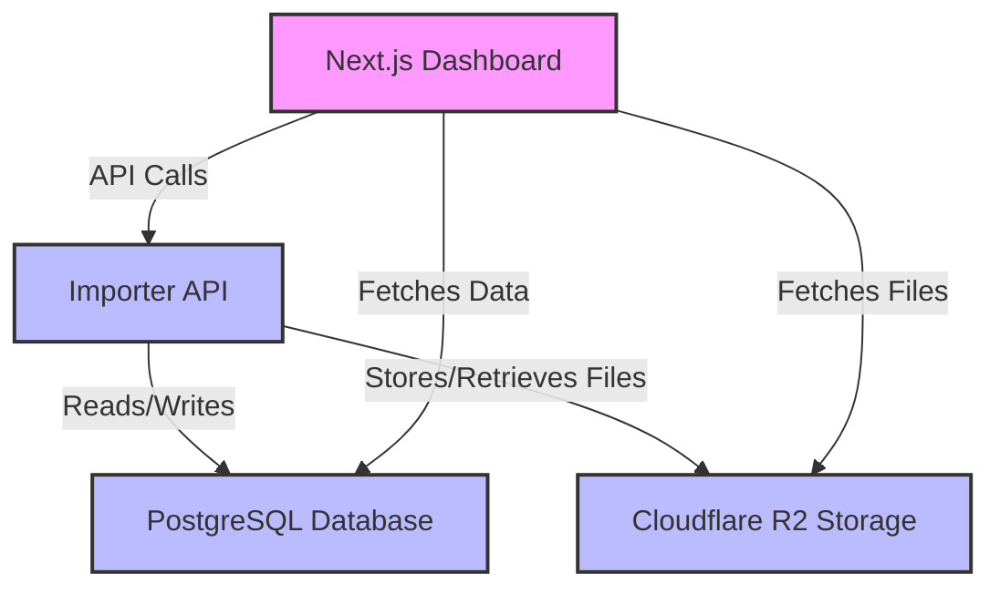
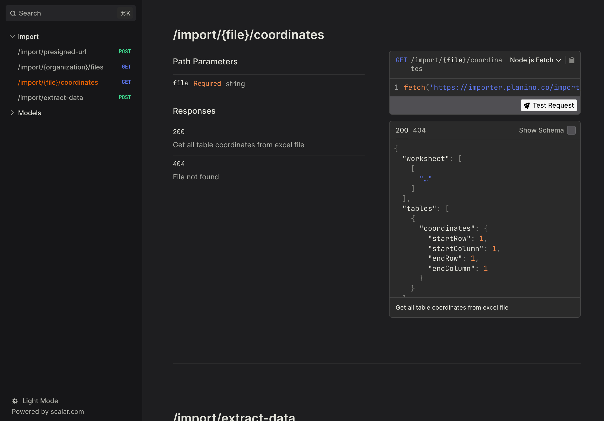
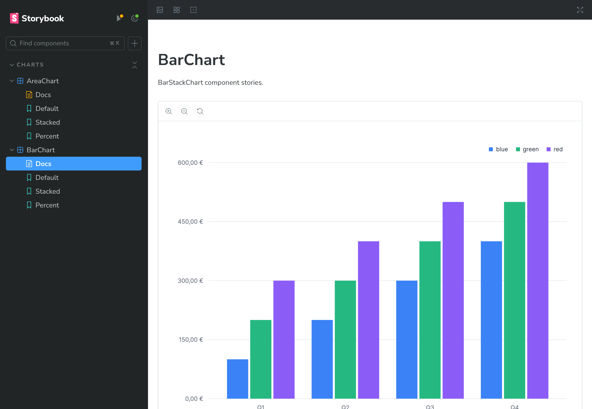
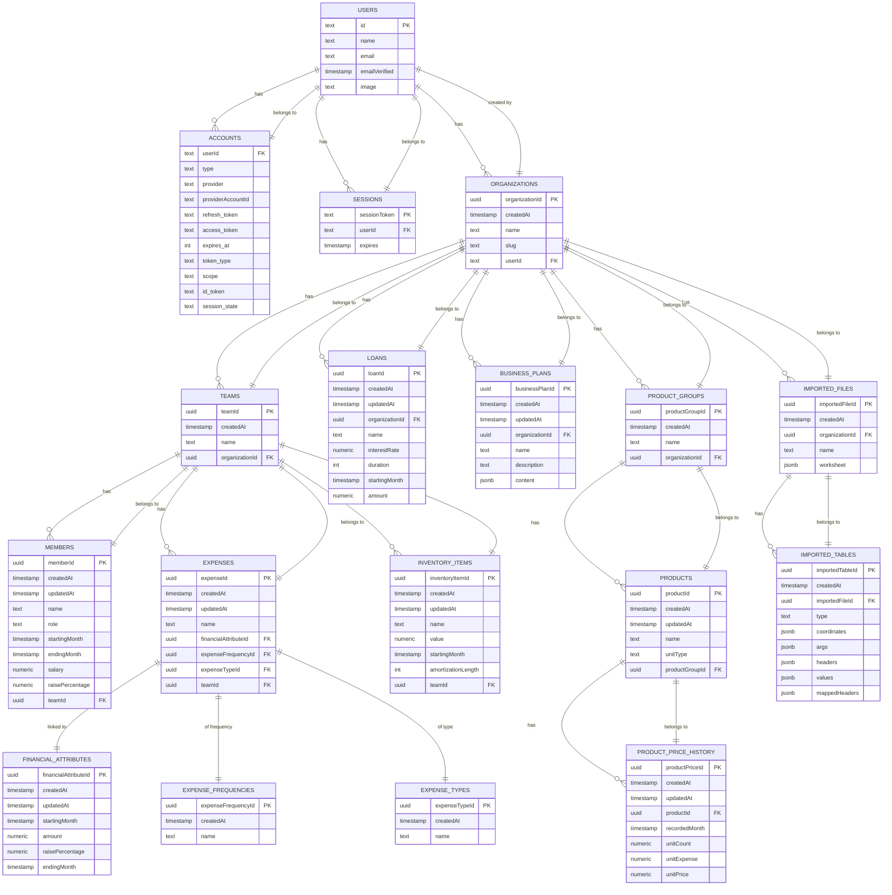

# Planino Application Documentation

## Application Structure

The project is organized as a "monorepo," a modern approach that allows centralized management of multiple projects within a single repository. This format simplifies development, maintenance, and scaling of applications.

The monorepo is divided into two main segments: application directories and package directories. The application directory contains user applications like "Importer" and "Dashboard," which are intended for user interaction. The package directory includes support for applications, such as "Database Package" for database interaction and "ESLint Shared Config" for ensuring code quality.

This approach enables better coordination, easier version control, and faster implementation of changes, promoting modularity and code reuse. Additionally, there are shared configurations for ESLint, Tailwind CSS, TypeScript, charts, and database packages.

## Application Infrastructure

The infrastructure used in the application is carefully designed to enable efficient and secure interaction between various components across multiple platforms. It consists of the following key elements:

- **Next.js Dashboard**: The frontend part of the application built with Next.js, hosted on the Vercel platform. This part of the application provides the user interface through which users can effectively use the application’s functionalities.
- **Importer API**: A backend API implemented on the Cloudflare Workers platform. This API handles business logic, database communication, and file management.
- **PostgreSQL Database**: The primary database used to store all relevant data required for the application’s functionality. PostgreSQL is a robust, scalable relational database that supports complex queries and transactions.
- **Cloudflare R2 Storage**: A storage space for files, integrated with the Importer API on the Cloudflare platform. R2 Storage provides high availability and performance for storage and retrieval operations.

The following diagram illustrates how these components connect and communicate within the infrastructure:

## Dashboard Application Routes

The root route is "/[organization]", which serves as the main entry point into the application for a specific organization. From this point, users can navigate through various sub-routes that provide specific functionalities or display certain data.

- **/cijena-i-kolicina**: View and manage information about product prices and quantities. The sub-route /[productId] provides a detailed view of a specific product.
- **/imovina-i-oprema**: Overview and management of information about the organization’s assets and equipment.
- **/odjeli**: Viewing and managing data about different departments within the organization.
- **/operativni-troskovi**: Access and manage information about the organization’s operational costs.
- **/podatci**: Main route for managing various data sets within the organization, with sub-routes /pregled for data review and /uvoz for importing new data.
- **/poslovni-planovi**: Access and manage business plans, with a detailed view of a specific plan through the sub-route /[businessPlanId].
- **/otplatni-planovi**: Manage repayment plans for loans and other financial commitments.
- **/prihodi**: View and manage information about the organization's income.
- **/racun-dobiti-i-gubitka**: Access the profit and loss account of the organization.
- **/tocka-pokrica**: Manage and review the breakeven point analysis.
- **/troskovi**: Access and manage various costs associated with the organization.

## API Documentation

The Importer API is designed for efficient processing and management of data imports for various organizations. It enables secure transfer and manipulation of files, as well as access to specific information within those files. Full documentation can be found at [importer.planino.co/reference](https://importer.planino.co/reference).

### Endpoints

#### POST /import/presigned-url

**Description**: Generate presigned URLs for importing data.

#### GET /import/{organization}/files

**Description**: Retrieve all Excel files from an organization's bucket.

#### POST /import/{file}/coordinates

**Description**: Generate coordinates and tables for given file.

## Storybook for Chart Components

Storybook is used in the Planino application to develop and showcase chart components in isolation. It allows for interactive testing, immediate visualization of changes, and comprehensive documentation of each component.

## Database

The database contains a series of tables that are interconnected to enable efficient data management within the organization. Each table has its specific role and is connected to other tables to ensure integration and consolidation of information.

- **Users (users)**: This table contains basic information about users, including their ID, name, email address, email verification date, and profile picture. The email address is mandatory for all users.
- **Accounts (accounts)**: This table stores data about different accounts associated with users. This includes account type, service provider, provider ID, and token data with expiration dates.
- **Sessions (sessions)**: The sessions table stores information about active user sessions, including session tokens and expiration dates.
- **Organizations (organizations)**: Each organization in the database has its unique identifier, name, and is linked to the user who created it. Organizations can have associated credits, teams, business plans, and product groups.
- **Teams (teams)**: Teams are grouped within organizations and have their data such as ID, creation date, and name.
- **Members (members)**: This table stores information about members of teams, including their ID, name, role, salary, and employment duration.
- **Loans (loans)**: The loans table records information about loans taken by organizations, including the loan amount, interest rate, duration, and start date.
- **Financial Attributes (financialAttributes), Expense Frequencies (expenseFrequencies), and Expense Types (expenseTypes)**: These tables enable detailed tracking of costs and financial attributes associated with teams and expenses.
- **Expenses (expenses)**: This table tracks specific expenses within teams, linking them to appropriate financial attributes, frequencies, and expense types.
- **Inventory Items (inventoryItems)**: This table is used for managing inventory within teams, including details such as value and depreciation period.
- **Business Plans (businessPlans)**: These tables allow organizations to structure and store their business plans and plan contents.
- **Product Groups (productGroups) and Products (products)**: Managing products and product groups allows organizations to organize their products and track their price history.
- **Product Price History (productPriceHistory)**: This table records the price history of products, including unit count, unit expense, and unit price at different times.
- **Imported Files (importedFiles)**: This table stores information about files imported into the system, including the file's name and content.
- **Imported Tables (importedTables)**: This table stores data extracted from imported files, including the table's coordinates, headers, and values.

